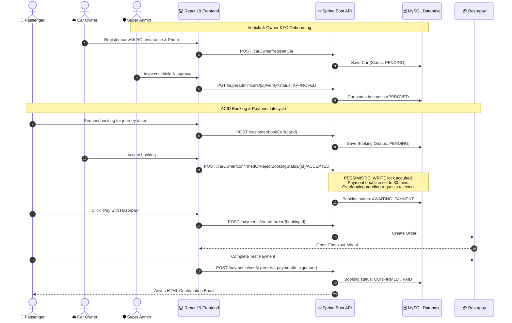

# 🚗 AutoRent Enterprise - Modern Full-Stack Car Rental Platform

[](https://spring.io/projects/spring-boot)
[](https://www.oracle.com/java/)
[](https://react.dev/)
[](https://vitejs.dev/)
[](https://tailwindcss.com/)
[](https://razorpay.com/)
[](https://cloudinary.com/)
[](https://www.mysql.com/)
[](LICENSE)

A production-grade, enterprise-ready **Car Rental Management System** built with **Spring Boot 3.5 (Java 21)** and **React 19 (Vite + Tailwind CSS v4)**. Designed with multi-role governance (Super Admin, Car Owner, Passenger), ACID-compliant concurrency locking for race-condition-free bookings, seamless Razorpay payments, Cloudinary media storage, and bank-grade stateless JWT authentication using HttpOnly cookies with Refresh Token Rotation (RTR).

---

## 🌟 Key Highlights & Engineering Features

### 1. 🛡️ Super Admin Governance & KYC Verification
* **Owner Verification**: Car owners must submit identity details and documents before their vehicles can be listed.
* **Vehicle KYC**: Every car undergoes administrative inspection (RC number, insurance expiration, photos) with `APPROVED` or `REJECTED` workflows.
* **Platform Security & Token Blacklisting**: Super Admin can instantaneously freeze malicious accounts; blocking an owner or passenger immediately invalidates all their active JWTs across the platform.

### 2. ⚡ ACID Concurrency & Race-Condition-Free Bookings
* **Pessimistic Database Locking (`PESSIMISTIC_WRITE`)**: Eliminates double-booking clashes if two passengers attempt to reserve the same car or if an owner processes simultaneous approvals.
* **Atomic State Machine**:
  $$\text{PENDING} \xrightarrow{\text{Owner Accepts}} \text{AWAITING\_PAYMENT} \xrightarrow{\text{Razorpay Success}} \text{CONFIRMED / PAID}$$
* **Auto-Rejection of Competing Requests**: Once a booking is accepted, competing overlapping requests for the same vehicle and journey window are automatically rejected within the same atomic transaction.
* **30-Minute Payment Deadline**: Passengers receive a 30-minute countdown to complete payment before the reservation automatically expires.

### 3. 🔐 Enterprise Cookie-Based Security (JWT + RTR)
* **Zero LocalStorage Token Leaks**: Access and Refresh tokens are delivered in secure, `HttpOnly`, `SameSite=Lax` cookies to defend against Cross-Site Scripting (XSS).
* **Refresh Token Rotation (RTR)**: Each token refresh issues a new pair and revokes the old one. If a revoked token is ever presented, the security system detects token reuse and invalidates the entire family.
* **Token Blacklist**: Logout and administrative block events record active tokens in a database blacklist with automated timestamp expiration.

### 4. 💳 Integrated Razorpay Payments & Transaction Limits
* **Amount Thresholds**: Enforced validation between ₹1.00 and ₹5,00,000.00 per transaction to strictly adhere to payment gateway and RBI standards.
* **Hit Rate Limits**: Protected by the Sliding Window Rate Limiter at 10 requests / minute per IP to prevent payment endpoint abuse.
* **Cryptographic Validation**: Automated HMAC-SHA256 signature verification preventing any tampering or replay attacks.
* **Built-in Mock Fallback**: Automatic mock order simulation for local development when credentials are in demo mode.

### 5. ☁️ Cloudinary Media Integration
* Direct high-speed image uploads for vehicle photos and verification documents.
* Automatic URL normalization with placeholder fallbacks when credentials are demo-only.

### 6. 📧 Asynchronous HTML Notifications
* `@Async` transactional emails sent via Spring Mail / SMTP.
* Clean, responsive HTML notification templates for:
  * Owner Registration & KYC Decisions.
  * Booking Requests & Owner Acceptance.
  * Payment Confirmation with Receipt Details.
  * Rejection alerts with customized feedback.

### 7. ⏱️ Graceful Shutdown & Standardized REST
* Configured with `server.shutdown=graceful` and a 20-second drain phase to guarantee uninterrupted transactions.
* Strict HTTP Status Codes (400 Bad Request, 401 Unauthorized, 403 Forbidden, 404 Not Found, 409 Conflict, 200 OK).

---

## 🏗️ System Architecture & Workflow



---

## 📁 Project Structure

```
Car-Rental/
├── client/                              # React 19 + Vite Frontend
│   ├── public/                          # Static assets
│   ├── src/
│   │   ├── components/                  # Navbar, Footer, CarCard, Modals
│   │   ├── pages/
│   │   │   ├── Home.jsx                 # Public landing & search
│   │   │   ├── CustomerDashboard.jsx    # Passenger bookings & Razorpay flow
│   │   │   ├── OwnerDashboard.jsx       # Owner fleet & booking requests
│   │   │   ├── SuperAdminDashboard.jsx  # KYC approvals & user governance
│   │   │   └── AddCarPage.jsx           # Vehicle listing with Cloudinary
│   │   ├── services/
│   │   │   ├── api.js                   # Axios client with RTR interceptor
│   │   │   └── razorpay.js              # Checkout loader & handler
│   │   ├── store/                       # Redux Toolkit slices
│   │   └── index.css                    # Tailwind CSS v4 styling
│   ├── .prettierrc                      # Prettier code formatting rules
│   ├── eslint.config.js                 # ESLint flat config
│   ├── vercel.json                      # Vercel SPA routing configuration
│   └── package.json
│
├── server/                              # Spring Boot 3.5 Java Backend
│   ├── src/main/java/com/rohit/car_rental_api_spring_boot_project/
│   │   ├── config/                      # Security, JWT, Cookies, Seeder
│   │   ├── controller/                  # REST Controllers (Auth, SuperAdmin, Owner, Customer, Payment)
│   │   ├── dto/                         # Request/Response Transfer Objects
│   │   ├── entity/                      # JPA Entities (Car, Booking, Payment, User, Tokens)
│   │   ├── enums/                       # BookingStatus, VerificationStatus, PaymentStatus
│   │   ├── exception/                   # Global Exception Handler (standard HTTP codes)
│   │   ├── mail/                        # Async HTML Email templates
│   │   ├── repository/                  # Spring Data JPA with Pessimistic Locking
│   │   └── service/                     # Core business logic & integrations
│   ├── src/main/resources/
│   │   └── application.properties       # DB, SMTP, JWT, and Cloud settings
│   ├── car-rental-api.postman_collection.json # Complete Postman API Suite
│   └── pom.xml                          # Maven dependencies
│
├── .gitignore                           # Git hygiene (ignores node_modules, target, .env)
└── README.md                            # Complete documentation
```

---

## 🚀 Quick Start Guide (Local Setup)

### Prerequisites
* **Java 21** (JDK 21+)
* **Node.js** (v18+) & **npm**
* **MySQL** (v8.0+)

---

### Step 1: Database Setup
Create a local MySQL database:
```sql
CREATE DATABASE `car-rental-api`;
```

---

### Step 2: Backend Setup (Spring Boot)
1. Navigate to the backend directory:
   ```bash
   cd server
   ```
2. Verify or modify database credentials in `src/main/resources/application.properties`:
   ```properties
   spring.datasource.url=jdbc:mysql://localhost:3306/car-rental-api?useSSL=false&allowPublicKeyRetrieval=true&serverTimezone=UTC
   spring.datasource.username=root
   spring.datasource.password=YOUR_MYSQL_PASSWORD
   ```
3. Run the Spring Boot server:
   ```bash
   ./mvnw spring-boot:run
   ```
   > 💡 The application will start on **`http://localhost:1571`** and automatically seed default roles and the Super Admin account:
   > - **Email**: `superadmin@carrental.com`
   > - **Password**: `SuperAdmin@2026`

---

### Step 3: Frontend Setup (React + Vite)
1. Open a new terminal and navigate to the `client` directory:
   ```bash
   cd client
   ```
2. Install dependencies:
   ```bash
   npm install
   ```
3. Run code formatting and linting:
   ```bash
   npm run lint
   npm run format
   ```
4. Start the development server:
   ```bash
   npm run dev
   ```
   > 🚀 The frontend is live at **`http://localhost:5173`**.

---

## 🌐 100% Free Live Cloud Deployment Guide (₹0 Cost)

You can host this entire full-stack application online **without spending a single rupee** and **without entering any credit card**!

```
               ┌───────────────────────────┐
               │    Vercel (Free Tier)     │
               │  Frontend: React 19 SPA   │
               └─────────────┬─────────────┘
                             │  HTTPS API Calls
                             ▼
               ┌───────────────────────────┐
               │    Render (Free Tier)     │
               │  Backend: Spring Boot Jar │
               └─────────────┬─────────────┘
                             │  JDBC Connection
                             ▼
               ┌───────────────────────────┐
               │ TiDB Cloud / Aiven (Free) │
               │   Cloud MySQL Database    │
               └───────────────────────────┘
```

---

### Part A: 100% Free Cloud MySQL Database (TiDB Cloud or Aiven)

#### Option 1: TiDB Cloud Serverless (Recommended - 5GB Free Forever, No Card Required)
1. Go to [TiDB Cloud](https://tidbcloud.com/) and sign up for free using your GitHub or Google account.
2. Click **Create Cluster** and choose **Serverless** (Free tier).
3. Once created, click **Connect** $\rightarrow$ select **Language: Java / Spring Boot**.
4. TiDB gives you your JDBC connection details:
   - **Host**: e.g., `gateway01.us-east-1.prod.aws.tidbcloud.com`
   - **Port**: `4000`
   - **Database**: `test` (or create `car_rental`)
   - **Username**: `xxxxxx.root`
   - **Password**: `YourTiDBPassword`
   - **JDBC URL format**: `jdbc:mysql://gateway01.us-east-1.prod.aws.tidbcloud.com:4000/test?sslMode=VERIFY_IDENTITY`

#### Option 2: Aiven MySQL Free Tier
- Sign up at [Aiven.io](https://aiven.io/), select **Free MySQL Service**, and copy the JDBC URI.

---

### Part B: 100% Free Backend Deployment (Render.com)

1. Push your project to **GitHub**.
2. Sign in to [Render.com](https://render.com/) with GitHub.
3. Click **New +** $\rightarrow$ **Web Service** $\rightarrow$ Connect your `Car-Rental` repository.
4. Set the build configuration:
   - **Root Directory**: `server`
   - **Runtime**: `Java` (or `Docker` / `Maven`)
   - **Build Command**: `./mvnw clean package -DskipTests`
   - **Start Command**: `java -jar target/car-rental-api-spring-boot-project-0.0.1-SNAPSHOT.jar`
5. In the **Environment Variables** tab on Render, add:
   | Variable | Value |
   | :--- | :--- |
   | `SPRING_DATASOURCE_URL` | Your TiDB or Aiven JDBC URL |
   | `SPRING_DATASOURCE_USERNAME` | Your Cloud DB username |
   | `SPRING_DATASOURCE_PASSWORD` | Your Cloud DB password |
   | `RAZORPAY_KEY_ID` | `rzp_test_placeholderKey123` (or your test key) |
   | `RAZORPAY_KEY_SECRET` | `placeholderSecret456` (or your test secret) |
   | `PORT` | `1571` |
6. Click **Deploy Web Service**. Render gives you a live URL (e.g., `https://car-rental-api.onrender.com`).

---

### Part C: 100% Free Frontend Deployment (Vercel)

1. Sign in to [Vercel](https://vercel.com/) with GitHub.
2. Click **Add New...** $\rightarrow$ **Project** $\rightarrow$ Import your `Car-Rental` repository.
3. In the project setup:
   - **Root Directory**: Click `Edit` and select `client`.
   - **Framework Preset**: `Vite`.
   - **Build Command**: `npm run build`.
   - **Output Directory**: `dist`.
4. In **Environment Variables**, add:
   | Variable | Value |
   | :--- | :--- |
   | `VITE_API_BASE_URL` | `https://car-rental-api.onrender.com/api/v1` |
5. Click **Deploy**.
   > 🎉 Your application is now live on `https://your-car-rental.vercel.app`!
   > 
   > The `client/vercel.json` included in this repository handles SPA rewrites so direct navigation and refreshes on routes like `/superadmin`, `/owner-dashboard`, etc., work cleanly without 404 errors.

---

## 📡 Key REST API Reference

All requests are prefixed with `/api/v1`.

### 1. Auth & Session Management
| Method | Endpoint | Description |
| :--- | :--- | :--- |
| `POST` | `/auth/registerCustomer` | Register a new passenger |
| `POST` | `/auth/registerCarOwner` | Register a new car owner |
| `POST` | `/auth/loginCustomer` | Passenger login (returns HttpOnly cookies) |
| `POST` | `/auth/loginCarOwner` | Car owner login (returns HttpOnly cookies) |
| `POST` | `/auth/loginSuperAdmin` | Super admin login (returns HttpOnly cookies) |
| `GET`  | `/auth/me` | Restore user session from HttpOnly cookie |
| `POST` | `/auth/refresh-token` | Silent Refresh Token Rotation (RTR) |
| `POST` | `/auth/logout` | Invalidate tokens and clear cookies |
| `POST` | `/auth/upload-image` | Upload car image or KYC document to Cloudinary |

### 2. Super Admin Governance
| Method | Endpoint | Description |
| :--- | :--- | :--- |
| `GET`  | `/superadmin/stats` | Platform KPIs (Fleet, Revenue, Pending counts) |
| `GET`  | `/superadmin/owners/pending` | List unverified car owners |
| `PUT`  | `/superadmin/owners/{id}/verify` | Approve or reject car owner (`status=APPROVED\|REJECTED`) |
| `GET`  | `/superadmin/cars/pending` | List unapproved vehicles |
| `PUT`  | `/superadmin/cars/{id}/verify` | Approve or reject vehicle listing |
| `GET`  | `/superadmin/users` | List all platform users |
| `PUT`  | `/superadmin/users/{type}/{id}/block` | Block or unblock user (`blocked=true\|false`) |

### 3. Car Owner Fleet Operations
| Method | Endpoint | Description |
| :--- | :--- | :--- |
| `POST` | `/carOwner/registerCar` | Register vehicle with RC, insurance date, and image |
| `GET`  | `/carOwner/getAllCars?page=0&size=6&sortBy=id&sortDir=desc` | Get paginated owned cars (`PageResponse<CarResponseDTO>`) |
| `GET`  | `/carOwner/carOwnerProfile` | View profile and verification status |
| `GET`  | `/carOwner/getPendingBookingForCarOwner` | View pending booking requests |
| `POST` | `/carOwner/confirmedOrRejectBookingStatus/{id}/{status}` | Accept or reject booking (locks car atomically) |

### 4. Passenger Bookings
| Method | Endpoint | Description |
| :--- | :--- | :--- |
| `GET`  | `/customer/getAllCars?page=0&size=6&sortBy=id&sortDir=desc` | Browse approved vehicles with pagination (`PageResponse<CarResponseDTO>`) |
| `POST` | `/customer/bookCar/{carId}` | Request car reservation |
| `GET`  | `/customer/getConfirmedBookingStatus?page=0&size=10` | View paginated booking history & countdowns (`PageResponse<BookingResponseDTO>`) |

### 5. Razorpay Payments
| Method | Endpoint | Description |
| :--- | :--- | :--- |
| `POST` | `/payments/create-order/{bookingId}` | Generate Razorpay order for accepted booking |
| `POST` | `/payments/verify` | Verify HMAC payment signature and confirm booking |

---

## 🧪 Testing with Postman

A unified, production-grade Postman collection is included directly in the repository:
[`server/Car-Rental-Management.postman_collection.json`](file:///d:/Rohit/Project/Car/server/Car-Rental-Management.postman_collection.json).

### How to Import & Run:
1. Open Postman $\rightarrow$ Click **Import**.
2. Select [`server/Car-Rental-Management.postman_collection.json`](file:///d:/Rohit/Project/Car/server/Car-Rental-Management.postman_collection.json).
3. Set the environment variable `baseUrl` to `http://localhost:1571/api/v1` (or your live backend URL).
4. Run requests across the cleanly structured, unnumbered folders:
   - **Authentication & Session Management**
   - **Super Admin Governance**
   - **Car Owner Portal**
   - **Customer Portal**
   - **Razorpay Payments & Receipts**

> [!TIP]
> **Automated Razorpay Signature Testing**:
> - **Create Order** auto-saves `orderId` and `bookingId` into collection variables.
> - **Verify Payment** includes a Pre-request Script with `CryptoJS.HmacSHA256(orderId + "|" + paymentId, keySecret)` that computes the valid cryptographic hash on the fly. Testing payment verification in Postman succeeds on the first click with `200 OK`!

---

## 🔒 Security & Rate Limiting Summary

- **Sliding Window Rate Limiter**: Enforces dynamic request limits per client IP (Auth: 5/min, Payments: 10/min, Bookings: 15/min, General: 100/min). Returns HTTP 429 with `Retry-After`.
- **Zero-Session Stateless Architecture**: `server.servlet.session.tracking-modes=` and Tomcat customizer `context.setCookies(false)` completely prevent `JSESSIONID` cookies.
- **Cross-Site Scripting (XSS) Mitigation**: JWT Access and Refresh tokens are completely inaccessible to client JavaScript due to `HttpOnly` cookie flags.
- **Cross-Site Request Forgery (CSRF) Mitigation**: Enforced with `SameSite=Lax` (local) / `SameSite=None; Secure=true` (cross-origin HTTPS) and custom frontend header policies.
- **Token Theft & Replay Protection**: Refresh Token Rotation (RTR) detects token reuse. If an attacker attempts to replay an old refresh token, the entire token family is revoked immediately.
- **Account Freeze**: Administrative block immediately blacklists existing tokens in the database, preventing any further authenticated requests.
- **Race Condition Resistance**: Pessimistic write locks (`PESSIMISTIC_WRITE`) at the database layer ensure no two bookings or approval decisions can conflict.

---

## 👥 Default Credentials for Quick Testing

| Role | Email | Password |
| :--- | :--- | :--- |
| **Super Admin** | `superadmin@carrental.com` | `SuperAdmin@2026` |
| **Car Owner** | `owner@example.com` | `Owner@123` (or register new) |
| **Passenger** | `customer@example.com` | `Customer@123` (or register new) |

---

## 📄 License
This project is open-source and licensed under the [MIT License](LICENSE).
